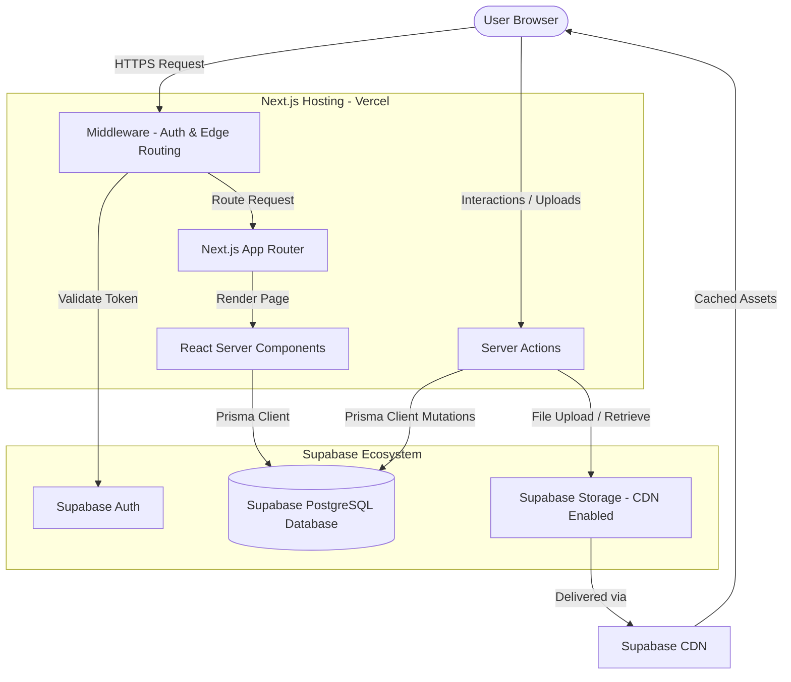

# Art of Mind — System Architecture & Technical Design

This document details the runtime architecture, non-functional requirements (NFRs), security configurations, and future scaling plans for **Art of Mind**.

For details on the design rationales, technology stack selection, and structural decisions, see **[DECISIONS.md (Architecture Decision Records)](file:///c:/Users/sayso/OneDrive/Documents/Art%20of%20Mind/docs/DECISIONS.md)**.

---

## 1. Deployment & Runtime Architecture

The following diagram illustrates how user requests route through the runtime infrastructure:

---

## 2. Non-Functional Requirements (NFRs)

| Category | Requirement | Target Metric / Standard |
| :--- | :--- | :--- |
| **Availability** | System Uptime | **99.9%** availability (excluding planned maintenance). |
| **Performance** | API Response Time | **< 300ms** for Server Action mutations and DB queries. |
| | Core Web Vitals (LCP) | **< 1.2s** Large Contentful Paint on standard 4G networks. |
| **Asset Size** | Image Upload Limits | Max **50MB** (covers, avatar graphics). |
| | Video/Audio Limits | Max **2GB** (comics, immersive background soundtracks). |
| **Browsers** | Supported Clients | Last 2 major versions of Chrome, Edge, Firefox, Safari. |
| **Accessibility** | Universal Design | **WCAG 2.1 Level AA** compliance. |
| | Font Preferences | System-wide support for OpenDyslexic typography. |
| | Colorblind Filters | Visual presentation filters (Protanopia, Deuteranopia, Tritanopia). |

---

## 3. Security Roadmap

- **CSRF Protection**: Next.js Server Actions automatically protect against CSRF attacks by validating the request host and origin headers.
- **Rate Limiting**: Implement token bucket rate limiting on authentication routes, comment actions, and file uploads using an Upstash Redis middleware layer.
- **XSS Mitigation**: React natively escapes HTML content. For rich text editors in the Creator Studio, input is sanitized on the server before database storage using `isomorphic-dompurify`.
- **SQL Injection Prevention**: Prisma client enforces parameterized queries under the hood, neutralizing common SQL injection vectors.
- **Secure Sessions**: User authentication cookies are issued with the `HttpOnly`, `Secure`, and `SameSite=Lax` flags to prevent client-side token extraction.
- **File Upload Validation**: Supabase Storage buckets enforce strict MIME-type allowlists (e.g., `image/png`, `image/jpeg`, `audio/mpeg`). File buffers are scanned on upload for file signature (magic number) verification.
- **Secrets Management**: Sensitive credentials (e.g., database connection strings, Supabase keys, payment gateway tokens) are never committed to git. They are managed through Vercel and Supabase dashboard secrets.
- **Content Moderation & Audit Logs**: The database schema supports `MODERATOR` and `ADMIN` roles. Moderation actions (deletes, reports, bans) are logged in an audit table for security reviews.

---

## 4. Future Scaling Plans

- **Redis Caching**: Deploy an ElastiCache or Redis instance to cache hot read paths (e.g., highly active story chapters, trending lists), bypassing PostgreSQL hits.
- **Serverless Background Queues**: Delegate CPU-intensive tasks (e.g., audio transcoding, notification emails, PDF generations) to a background worker system (such as Inngest or BullMQ) to keep HTTP threads unblocked.
- **Full-Text & Vector Search**: Implement search capabilities:
  - **Full-text**: Leveraging PostgreSQL `pg_trgm` and indexes for phrase matching.
  - **Semantic Vector Search**: Using Supabase `pgvector` to recommend stories based on user taste embeddings.
- **CDN Optimization**: Set up aggressive caching headers (`Cache-Control: public, max-age=31536000`) on static image assets hosted in Supabase Storage.
- **Analytics Pipeline**: Offload telemetry, clickstreams, and reader tracking to an analytics database (like BigQuery or ClickHouse) to prevent clogging the primary OLTP PostgreSQL instance.
