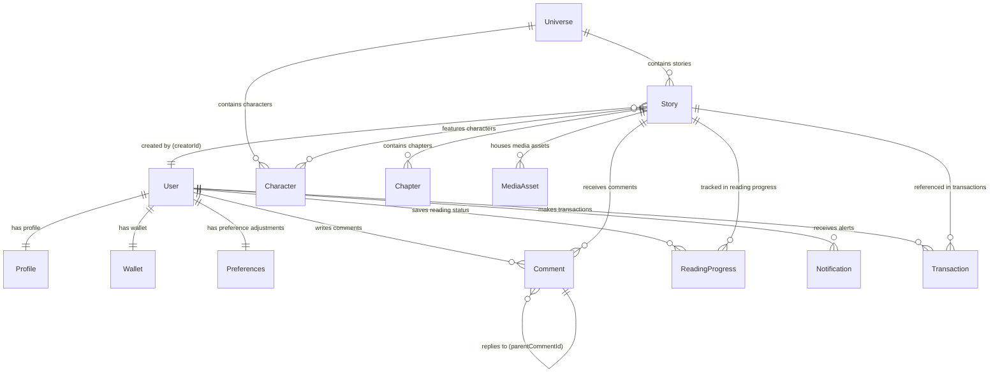

# Art of Mind — Application Data Model

This document details the data models, relationship structures, indexing configurations, and migration policies for **Art of Mind**.

---

## 1. Entity Relationship Diagram (ERD)

The following diagram illustrates the relationship structure of the application models (PostgreSQL schema managed via Prisma):



---

## 2. Model Specifications & Relationships

| Model | Purpose | Key Attributes | Relationships |
| :--- | :--- | :--- | :--- |
| **User** | Core application user account. | `id` (UUID), `supabaseId` (Auth Reference), `role` (READER, CREATOR, MODERATOR, ADMIN) | 1:1 Profile, 1:1 Wallet, 1:1 Preferences. |
| **Profile** | Public-facing creator/reader profile. | `id` (UUID), `displayName`, `avatarUrl`, `bio` | 1:1 User. Cascades on User delete. |
| **Preferences** | Client accessibility configurations. | `id` (UUID), `fontSize`, `dyslexiaFont` (Bool), `readingBg`, `colorblindMode` (Bool) | 1:1 User. Cascades on User delete. |
| **Wallet** | Balance tracking for creator payouts. | `id` (UUID), `balance` (Float), `payoutMethod` | 1:1 User. Cascades on User delete. |
| **Universe** | Core narrative framework. | `id` (UUID), `name`, `description` | 1:N Stories, 1:N Characters. |
| **Story** | Story metadata across various formats. | `id` (UUID), `title`, `type` (Enum), `rating`, `isPublished`, `deletedAt` (Soft Delete) | N:1 Universe, 1:N Chapters, N:M Characters, N:1 User (Creator). |
| **Chapter** | Text divisions under a Story. | `id` (UUID), `title`, `content` (TEXT), `index` (Int), `deletedAt` (Soft Delete) | N:1 Story. Cascades on Story delete. |
| **MediaAsset** | Audio files, illustrations, or comic panels. | `id` (UUID), `assetUrl`, `type` (String), `duration` (Float) | N:1 Story. Cascades on Story delete. |
| **Character** | Profile representation of story cast. | `id` (UUID), `name`, `role`, `avatarUrl` | N:1 Universe, M:N Stories. |
| **Comment** | Community messages on Stories. | `id` (UUID), `text`, `likes`, `hearts`, `laughs`, `deletedAt` (Soft Delete) | N:1 Story, N:1 User, N:1 Parent Comment (Replies). |
| **ReadingProgress** | Reader bookmark status tracking. | `id` (UUID), `chapterIndex`, `percent` | Unique user/story key. Cascades on User/Story delete. |
| **Notification** | User-specific system alert. | `id` (UUID), `type`, `message`, `read` (Bool) | N:1 User. Cascades on User delete. |
| **Transaction** | Credit purchase or creator unlocking. | `id` (UUID), `amount` (Float), `type` (String) | N:1 User, N:1 Story (SetNull on delete). |

---

## 3. Database Indexing Strategy

To maintain $O(\log N)$ reading speeds for search queries, infinite scrolls, and creator dashboard stats, PostgreSQL indexes are defined as follows:

```prisma
// Defined on Story model
@@index([type])          // Speeds up filters for Novels vs Reels vs Comics
@@index([universeId])    // Resolves franchise relation lookups
@@index([creatorId])     // Speeds up the Creator Studio dashboard loading
@@index([rating])        // Optimizes sorting stories by review scores
@@index([publishedAt])   // Speeds up chronologically sorted home feeds
@@index([isPublished])   // Filters drafts out of public views

// Defined on Chapter model
@@index([storyId])       // Fetches all chapters in a story
@@index([index])         // Optimizes ordering chapters sequentially

// Defined on ReadingProgress model
@@unique([userId, storyId]) // Prevents duplicate progress tracks per user
```

---

## 4. Database Lifecycle Policies

### Migration Policy
1. **One Migration Per Logical Change**: Do not bundle unrelated schema changes into a single migration file. For example, adding `Preferences` fields and modifying the `Wallet` model should be committed as two distinct migrations.
2. **Deterministic Migration Naming**: Name migrations cleanly using lowercase snake_case (e.g. `20260703120000_add_preferences_colorblind_mode`).
3. **Staging Validation**: Database migrations must run against a staging instance during CI builds before code is merged into the main deployment branch.

### Rollback Strategy
- Every database modification must be backwards-compatible (e.g. fields must be added as nullable initially or provided with defaults).
- Before applying a destructive schema change (such as dropping a column or table), a manual SQL rollback script must be prepared and tested.
- Schema changes are paired with a rollback policy that preserves archived/soft-deleted rows during data migration.

### Database Seeding Policy
- **Development Seed**: Executed locally via `npx prisma db seed`. It seeds a complete dataset including mock readers, profiles, test universes, nested chapters, and dummy comments to bootstrap local testing.
- **Production Seed**: Configured as an idempotent baseline script. It seeds *only* static configuration records (such as standard roles or default preferences keys) and exits if application data already exists. It never inserts dummy profiles or fake reading progress.
