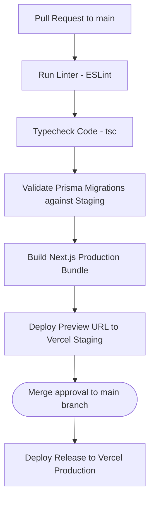

# Art of Mind — Deployment & Infrastructure Guide

This document describes the hosting platforms, configuration keys, and continuous integration / continuous deployment (CI/CD) pipelines for **Art of Mind**.

---

## 1. Infrastructure Specifications

### Hosting & Providers
- **Frontend & Node server**: Hosted on **Vercel** to leverage serverless functions, fast edge routing, and simple Next.js API integrations.
- **Database & Services**: Hosted on **Supabase** (AWS regions), providing a relational PostgreSQL database, user authentication services, and object storage.

### Storage Bucket Configurations
We utilize Supabase Storage for serving visual and audio media assets.

| Bucket Name | Access Policy | Use Case | Security Rules |
| :--- | :--- | :--- | :--- |
| `public-covers` | Public Read | Book cover images, user profile avatars. | Public read allowed. Authenticated upload allowed only if user owns the resource (`userId` matches uploader). |
| `private-media` | Private Read | Audiobook narration MP3s, premium comic panels, exclusive illustrations. | Read access requires tokenized signed URLs generated server-side. Upload restricted to content creators. |

### Environment Variables Manifest
Configure these keys in Vercel and your local `.env` files. **Never commit raw credentials to version control.**

- `DATABASE_URL`: Connection pooler URL (Supabase port `6543`) for standard runtime transactions.
- `DIRECT_URL`: Direct database URL (Supabase port `5432`) used for running Prisma migrations.
- `NEXT_PUBLIC_SUPABASE_URL`: API gateway URL for your Supabase project.
- `NEXT_PUBLIC_SUPABASE_ANON_KEY`: Client-safe key for front-end API initialization.
- `SUPABASE_SERVICE_ROLE_KEY`: Admin service key for backend operations. **Keep secure.**
- `NEXT_PUBLIC_SITE_URL`: Application root domain (e.g. `https://artofmind.app` or `http://localhost:3000`) resolving email confirmation redirects.

---

## 2. CI/CD Pipeline

Code checks, builds, and deploys are automated using GitHub Actions.

### CI/CD Steps & Quality Checks
1. **GitHub Trigger**: Opening a Pull Request triggers the integration workflow.
2. **Linting**: Runs `npm run lint` to check for syntax and style issues.
3. **Typechecking**: Runs `npx tsc --noEmit` to verify type safety.
4. **Prisma Validation**: Runs a migration dry-run on a staging schema to ensure migrations apply clean and seed scripts execute.
5. **Build Compilation**: Compiles the application using Next.js build engines to verify client/server bundles compile correctly.
6. **Deployment**: Deploys a staging preview URL. Once reviewed and merged into the `main` branch, the production deployment is pushed live.
