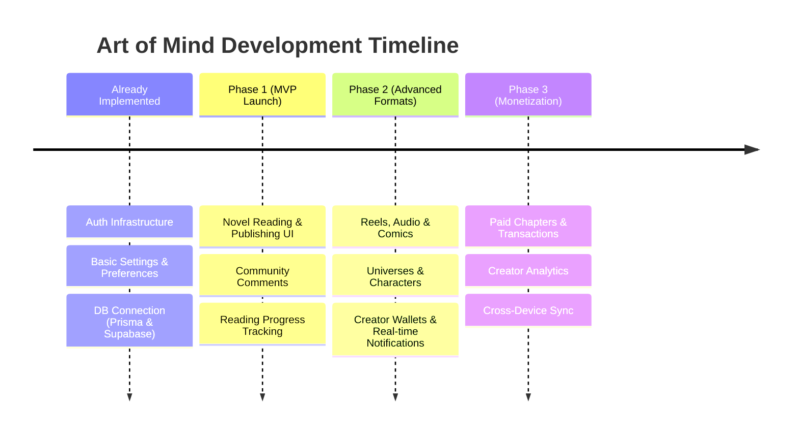

# Art of Mind — Product Roadmap

This document outlines the product vision, MVP boundaries, and developmental phases for **Art of Mind**, an interactive, multi-format storytelling platform.

---

## 1. Product Vision

Art of Mind aims to empower creators and captivate readers by bridging traditional long-form writing with interactive, visual, and auditory experiences. Instead of limiting stories to text, creators can expand their work across five core formats:
- **Novels**: Classic scroll-based text with rich typography and custom themes.
- **Reels**: Fast-paced, snackable fiction designed for mobile reading.
- **Audio**: Immersive narration and voice-over integration.
- **Comics**: Panel-by-panel graphic storytelling.
- **Interactive**: Choice-based branching narratives that react to reader input.

By organizing content around shared **Universes** and **Characters**, creators can build interconnected franchises where characters carry across different story formats.

---

## 2. MVP (Minimum Viable Product) Definition

The MVP focuses on establishing the core **Novel** reading loop, creator publishing workflow, and key accessibility configurations. The goal is to validate the developer-to-reader pipeline, authentication, and database connection.

### Core Workflows in MVP
1. **Readers**: Authenticate, configure reading preferences (text size, dyslexia-friendly font, background theme), browse novels, and read chapters while tracking reading progress.
2. **Creators**: Create and edit stories under a unified dashboard, publish chapters, and link their stories to a broader creative universe.

---

## 3. Development Phases

### Stage 0: Already Implemented
- **Authentication**: Core authentication flow (Sign up, login, OTP input, middleware protections) utilizing Supabase Auth.
- **Preferences**: A database-backed preferences model that lets users configure font size, dyslexia font overrides, and reading background options, with state synchronized directly from the database.
- **User Database Separation**: Configured the internal PostgreSQL database (via Prisma) to synchronize with Supabase Auth identities via UUID mapping (`supabaseId`).

---

### Phase 1: MVP Novel Reading & Publishing (Current Focus)
The objective of this phase is to build the baseline user experiences for consuming and publishing novel content.

- **Novel Reading Interface**: Clean, distraction-free reading layout supporting dark mode, sepia, and custom typography toggles.
- **Creator Studio (Novels)**: A dashboard allowing creators to write, edit, and organize chapters, save drafts, and publish stories.
- **Community Comments**: A comment section on chapters supporting reactions (likes, hearts, laughs) and nested replies.
- **Reading Progress**: Seamless scroll-triggered progress tracking that persists reading percentages and last-read chapters.

---

### Phase 2: Advanced Formats & Social Integration
This phase expands the platform's multi-format capabilities and enhances community engagement.

- **Reels, Comics, & Audio**: Support for short-form scroll stories, panel-by-panel comic uploads, and audio-narrated chapters.
- **Universes & Character Databases**: Tools to define shared lore databases. Creators can link characters to multiple stories, allowing readers to explore character sheets and universe detail pages.
- **Real-Time Notifications**: Push notifications for new chapters, replies to comments, or system alerts.
- **Creator Wallets**: Basic wallet configuration tracking virtual earnings and configuring payout methods.

---

### Phase 3: Monetization & Creator Analytics
This phase introduces economic loops and analytics engines.

- **Micropayments & Chapter Unlocks**: Support for transactions where readers can purchase individual premium chapters or support creators directly.
- **Advanced Creator Analytics**: Visual dashboards showing reader engagement, churn points per chapter, revenue trends, and reading frequency.
- **Cross-Device Preference Sync**: Real-time preference synchronization and offline-first reading caches.
