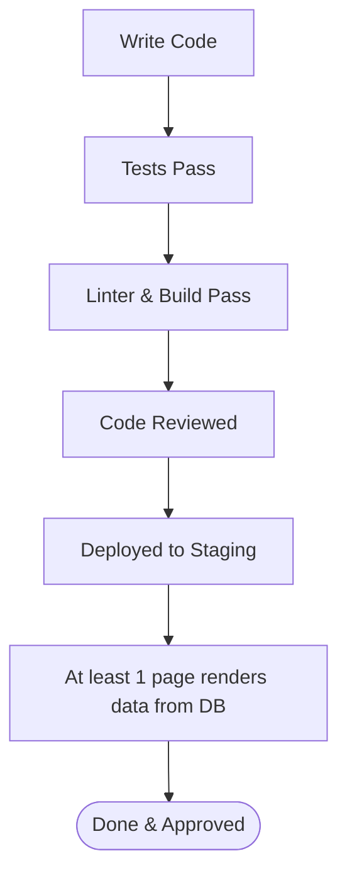

# Art of Mind — Sprints & Definition of Done

This document establishes the project delivery cadence, the Quality Gates (Definition of Done) for active milestones, and the Acceptance Criteria for core MVP components of **Art of Mind**.

---

## 1. Development Cadence

Development is organized into one-week sprints. Each sprint starts with planning and ends with an engineering review, demo, and retrospective.

| Sprint | Goal | Key Scope |
| :--- | :--- | :--- |
| **Sprint 1** | Foundations & Integration | Auth integration, user preferences persistence, and initial page rendering from PostgreSQL. |
| **Sprint 2** | Reader MVP | Novel reading interface, chapter progression, and bookmark progress tracking. |
| **Sprint 3** | Creator MVP | Creator Studio story setup, draft saves, and chapter publishing. |
| **Sprint 4** | Community & Polish | Comments (replies, reactions), notifications dropdown, and final bug validation. |

---

## 2. Definition of Done (DoD)

To merge code or declare a sprint complete, the following criteria must be satisfied:

- **Compilation**: Code builds successfully without TypeScript or Webpack errors.
- **Linting & Formatting**: Clean run of `npm run lint` and `npx prettier --check` with zero errors.
- **Code Review**: At least one peer review approval on the Pull Request.
- **Automated Tests**: Unit and integration test suites run with 100% pass rate.
- **Database Migrations**: Schema modifications are successfully applied, tested, and validated against the staging database.
- **Full-Stack Validation (Critical Gate)**: *At least one user-facing route renders dynamic data pulled directly from the PostgreSQL database using Prisma, rather than using `mock-data.ts` values.*

---

## 3. Core MVP Feature Acceptance Criteria

### Feature A: User Notifications Dropdown
- **AC 1 (Unread Count Badge)**: The notification icon must display a red badge indicating the current count of unread notifications. If the count exceeds 9, display `9+`. If the count is 0, the badge must be hidden.
- **AC 2 (Click Outside to Close)**: Clicking the notification icon toggles the dropdown box. Clicking anywhere outside the dropdown box or the icon must immediately close the dropdown.
- **AC 3 (Mark All Read)**: Clicking "Mark all read" must send a Server Action to toggle all of the user's unread notifications to `read: true` in PostgreSQL and immediately update the unread count in the UI.
- **AC 4 (Empty State)**: If the user has zero notifications in their inbox, the dropdown must render a clean empty state graphic and the text: *"You have no notifications at the moment."*

### Feature B: Reading Progress Tracker
- **AC 1 (Scroll Progress)**: As a reader scrolls down a chapter, the system must track scroll percentage. The scroll event must be throttled (e.g., every 200ms) to avoid lagging the UI thread.
- **AC 2 (Checkpoint Save)**: The system must persist reading progress back to the database under the `ReadingProgress` model in the following scenarios:
  - Every 10% progress increase.
  - When the user navigates away from the page (using `beforeunload` or component unmount hooks).
  - When the reader clicks "Next Chapter".
- **AC 3 (Resume Bookmark)**: When returning to a story, the detail page must display a prominent *"Resume Reading"* button pointing to the last-read chapter index, placing the scrollbar precisely at the stored scroll percentage checkpoint.

### Feature C: Story Detail Page (Novels)
- **AC 1 (Metadata Display)**: The story landing page must render the cover image, title, rating, and creator username.
- **AC 2 (Chapter List)**: Render all published chapters in chronological order by their index. Chapters marked as drafts or soft-deleted (`deletedAt != null`) must be invisible to standard readers but editable by the story creator.
- **AC 3 (Universe Context)**: If the story belongs to a shared universe, display a link card pointing to the Universe Detail Page (e.g., *"Part of the [Universe Name] Universe"*).
